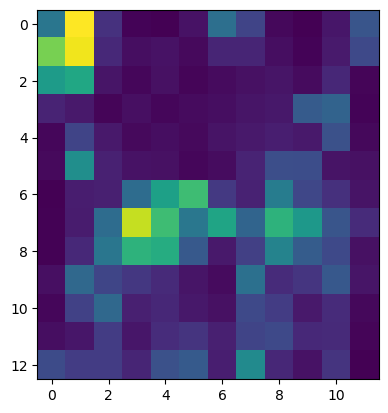
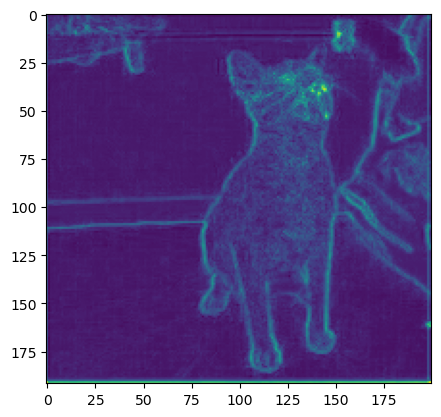
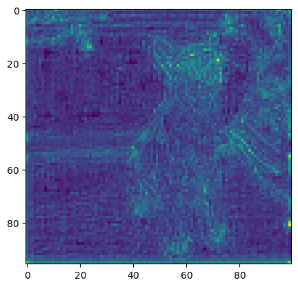
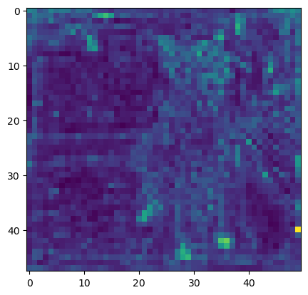
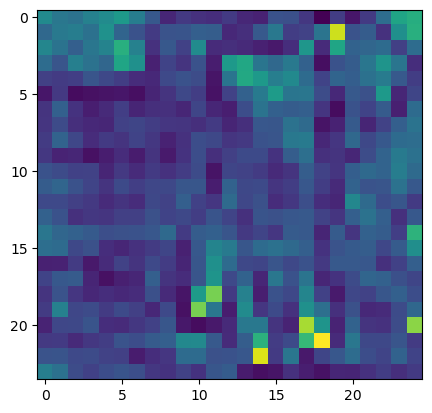
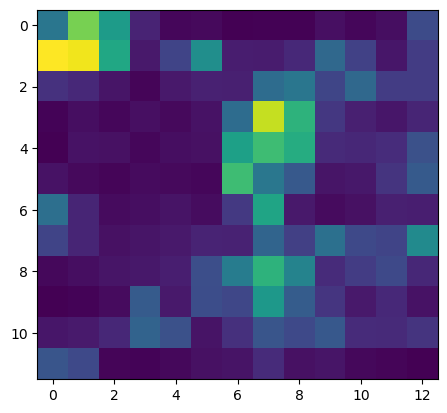
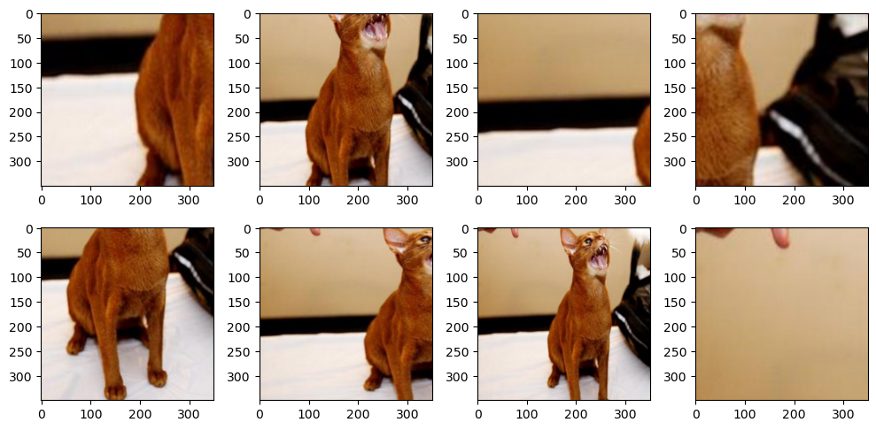
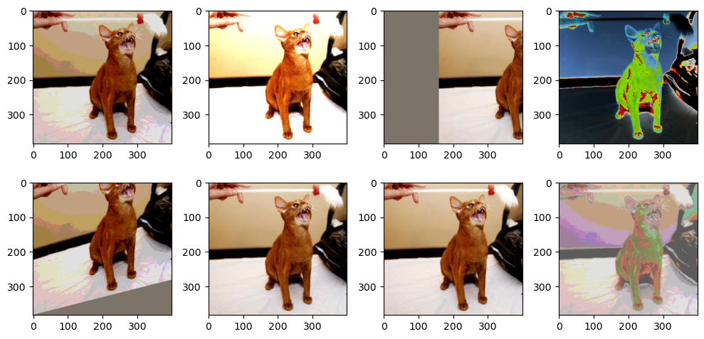
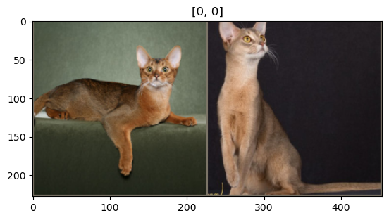
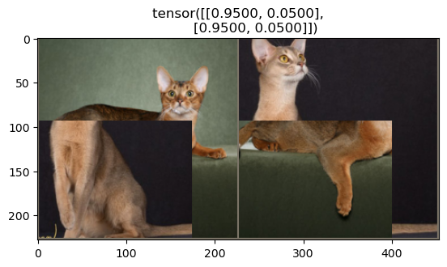

# 基础教程
这个教程主要依据 

[Getting Started with PyTorch Image Models (timm): A Practitioner’s Guide](https://towardsdatascience.com/getting-started-with-pytorch-image-models-timm-a-practitioners-guide-4e77b4bf9055)

## Models
下载完`timm`后
```python
import timm

print(timm.__version__)
0.9.16
```
目前使用的版本是0.9.16

同时可以展示目前`timm`上有多少可用的模型：

```
# We can list, and query, the collection available models as demonstrated below:
print(f'available models: {len(timm.list_models('*'))}')
# We can also use the pretrained argument to filter this selection to the models with pretrained weights:
print(f'models with pretrained weights: {len(timm.list_models(pretrained=True))}')

available models: 1032
models with pretrained weights: 1329
```
这里models with pretrained weights的数量大于available models的数量是因为模型的权重有多种来源。

这里使用比较熟悉的ResNet模型：
```python
resnet_family = timm.list_models('resnet*')
print(len(resnet_family))
vgg_family = timm.list_models('vgg*')
print(len(vgg_family))
print(vgg_family)

60
8
['vgg11', 'vgg11_bn', 'vgg13', 'vgg13_bn', 'vgg16', 'vgg16_bn', 'vgg19', 'vgg19_bn']
```


### 创建模型
> Let’s demonstrate this by creating a Resnet-D model, as introduced in the [Bag of Tricks for Image Classification For Convolutional Neural Networks paper](https://arxiv.org/abs/1812.01187); which is a modification on the ResNet architecture that utilises an average pooling tweak for down-sampling.

这里使用Resnet-D模型
```python
model = timm.create_model('resnet50d', pretrained=True)
print(model, type(model))

ResNet(
  (conv1): Sequential(
    (0): Conv2d(3, 32, kernel_size=(3, 3), stride=(2, 2), padding=(1, 1), bias=False)
    (1): BatchNorm2d(32, eps=1e-05, momentum=0.1, affine=True, track_running_stats=True)
    (2): ReLU(inplace=True)
    (3): Conv2d(32, 32, kernel_size=(3, 3), stride=(1, 1), padding=(1, 1), bias=False)
    (4): BatchNorm2d(32, eps=1e-05, momentum=0.1, affine=True, track_running_stats=True)
    (5): ReLU(inplace=True)
    (6): Conv2d(32, 64, kernel_size=(3, 3), stride=(1, 1), padding=(1, 1), bias=False)
  )
  (bn1): BatchNorm2d(64, eps=1e-05, momentum=0.1, affine=True, track_running_stats=True)
  (act1): ReLU(inplace=True)
  (maxpool): MaxPool2d(kernel_size=3, stride=2, padding=1, dilation=1, ceil_mode=False)
  (layer1): Sequential(
    (0): Bottleneck(
      (conv1): Conv2d(64, 64, kernel_size=(1, 1), stride=(1, 1), bias=False)
      (bn1): BatchNorm2d(64, eps=1e-05, momentum=0.1, affine=True, track_running_stats=True)
      (act1): ReLU(inplace=True)
      (conv2): Conv2d(64, 64, kernel_size=(3, 3), stride=(1, 1), padding=(1, 1), bias=False)
      (bn2): BatchNorm2d(64, eps=1e-05, momentum=0.1, affine=True, track_running_stats=True)
      (drop_block): Identity()
      (act2): ReLU(inplace=True)
      (aa): Identity()
      (conv3): Conv2d(64, 256, kernel_size=(1, 1), stride=(1, 1), bias=False)
      (bn3): BatchNorm2d(256, eps=1e-05, momentum=0.1, affine=True, track_running_stats=True)
...
  )
  (global_pool): SelectAdaptivePool2d(pool_type=avg, flatten=Flatten(start_dim=1, end_dim=-1))
  (fc): Linear(in_features=2048, out_features=1000, bias=True)
) 

<class 'timm.models.resnet.ResNet'>
```
通过`pretrained_cfg`属性，可以获得模型的进一步信息，比如输入数据的维度，目标类的大小等等。

```python 
print(model.pretrained_cfg)

{'url': 'https://github.com/rwightman/pytorch-image-models/releases/download/v0.1-weights/resnet50d_ra2-464e36ba.pth',
 'hf_hub_id': 'timm/resnet50d.ra2_in1k',
 'architecture': 'resnet50d',
 'tag': 'ra2_in1k',
 'custom_load': False,
 'input_size': (3, 224, 224),
 'test_input_size': (3, 288, 288),
 'fixed_input_size': False,
 'interpolation': 'bicubic',
 'crop_pct': 0.875,
 'test_crop_pct': 0.95,
 'crop_mode': 'center',
 'mean': (0.485, 0.456, 0.406),
 'std': (0.229, 0.224, 0.225),
 'num_classes': 1000,
 'pool_size': (7, 7),
 'first_conv': 'conv1.0',
 'classifier': 'fc',
 'origin_url': 'https://github.com/huggingface/pytorch-image-models'}
```

> One less well known, but incredibly useful, feature of timm models is that they are able to work on input images with varying numbers of channels, which pose a problem for most other libraries; an excellent explanation of how this works is described [here](https://timm.fast.ai/models#So-how-is-timm-able-to-load-these-weights?). Intuitively, timm does this by summing the weights of the initial convolutional layer for channels fewer than 3, or intelligently replicating these weights to the desired number of channels otherwise.

> We can specify the number of channels for our input images by passing the in_chans argument to create_model.

另一个比较有用的功能是timm模型允许我们改变输入图片的channels, 可以在创建模型的时候传入in_chans参数进行指定：

```python
model = timm.create_model('resnet50d', pretrained=True, in_chans=1)
# single channel image
x = torch.randn(1, 1, 224, 224)
model(x).shape

torch.Size([1, 1000])
```

### 自定义模型

`create_model`函数还提供了其他的参数供我们自定义模型：
- in_chans: 如上文提到的，可以修改模型对输入图片维度的要求
- global_pool: 选择在最后分类层之前使用什么类型的global pooling
- drop_rate: 为训练设置dropout rate（默认为0）
- num_classes：修改目标类数量

#### 修改目标类数量
正如我们在上文看到的ResNet-D模型架构一样，最后分类层叫做fc.

`(fc): Linear(in_features=2048, out_features=1000, bias=True)`

所以同其他库一样，可以直接通过`model.fc`去访问分类层。但是并不一定所有的模型都是这样的结构，因此timm额外提供了`get_classifier()`方法去获得最后分类层

```python
model.get_classifier()

Linear(in_features=2048, out_features=1000, bias=True)
```
通过传入num_classes参数修改模型的目标类数量

```python
NUM_FINETUNE_CLASSES = 10
model = timm.create_model('resnet50d', pretrained=True, num_classes=NUM_FINETUNE_CLASSES)
model.get_classifier()

Linear(in_features=2048, out_features=10, bias=True)
```

但如果有时候想要去查看倒数第二层的输出结果，可以将输出类的数量设置为0，这样会创建一个identity function, 可以直接输出上一层的结果：

```python
NUM_FINETUNE_CLASSES = 0
model = timm.create_model('resnet50d', pretrained=True, num_classes=NUM_FINETUNE_CLASSES)
model.get_classifier()

Identity()
```

#### Global Pooling
同样，根据之前输出的模型结构，我们可以看到global pooling层在最后分类层前使用，我们可以通过
`model.global_pool`的方式去查看global pooling层的设置：

`SelectAdaptivePool2d(pool_type=avg, flatten=Flatten(start_dim=1, end_dim=-1))`

这里看到返回了一个SelectAdaptivePool2d的实例，其提供了不同的pooling和flattening的配置选择，目前支持的选择有：
- avg : Average pooling
- max : Max pooling
- avgmax: the sum of average and max pooling, re-scaled by 0.5
- catavgmax: a concatenation of the outputs of average and max pooling along feature dimension. Note that this will double the feature dimension.
- ‘’ : No pooling is used, the pooling layer is replaced by an Identity operation

我们可以展示当使用不同种类pooling时输出的结果, (这里通过设置num_classes=0来输出倒数第二层的结果)：

```python
pool_types = ['avg', 'max', 'avgmax', 'catavgmax', '']
NUM_FINETUNE_CLASSES = 0
for pool in pool_types:
    model = timm.create_model('resnet50d', pretrained=True, 
                              num_classes=NUM_FINETUNE_CLASSES, 
                              **global_pool = pool**)
    model.eval() # create_model 默认返回的为train模式， 所以测试的时候要改为eval mode
    feature_output = model(torch.randn(1, 3, 224, 224))
    print(f'{pool}:{feature_output.shape}')

avg:torch.Size([1, 2048])
max:torch.Size([1, 2048])
avgmax:torch.Size([1, 2048])
catavgmax:torch.Size([1, 4096])
:torch.Size([1, 2048, 7, 7])
```

#### 修改存在的模型
我们可以使用`reset_classifier`函数同时修改分类层目标类的数量以及pooling层

```python
m = timm.create_model('resnet50d', pretrained=True)

print(f'Origianl pooling: {m.global_pool}')
print(f'Origianl classifier: {m.get_classifier()}')
print('-'*100)

m.reset_classifier(10, 'max')

print(f'Modified pooling: {m.global_pool}')
print(f'Modified classifier: {m.get_classifier()}')

Origianl pooling: SelectAdaptivePool2d(pool_type=avg, flatten=Flatten(start_dim=1, end_dim=-1))
Origianl classifier: Linear(in_features=2048, out_features=1000, bias=True)
---------------------------------------------------------------------------------------------------
Modified pooling: SelectAdaptivePool2d(pool_type=max, flatten=Flatten(start_dim=1, end_dim=-1))
Modified classifier: Linear(in_features=2048, out_features=10, bias=True)
```

#### 创建一个新的分类层
> when finetuning models on downstream tasks, I’ve often found that using a slightly larger head can lead to increased performance. Let’s explore how we can modify our ResNet model further.

> As we are using a larger head, let’s use catavgmax for our pooling, so that we provide more information as input to our classifier.

使用较大的分类层能够提高模型效果：
```python
NUM_FINETUNE_CLASSES = 10
model = timm.create_model('resnet50d', pretrained=True,
                           num_classes=NUM_FINETUNE_CLASSES, global_pool='catavgmax')

num_in_features = model.get_classifier().in_features
print(num_in_features)
print(model.get_classifier())

4096
Linear(in_features=4096, out_features=10, bias=True)
```
```python
model.fc = nn.Sequential(
    nn.BatchNorm1d(num_in_features),
    nn.Linear(in_features=num_in_features, out_features=512, bias=False),
    nn.ReLU(),
    nn.BatchNorm1d(512),
    nn.Dropout(0.4),
    nn.Linear(in_features=512, out_features=NUM_FINETUNE_CLASSES, bias=False)
)
print(model.get_classifier())

Sequential(
  (0): BatchNorm1d(4096, eps=1e-05, momentum=0.1, affine=True, track_running_stats=True)
  (1): Linear(in_features=4096, out_features=512, bias=False)
  (2): ReLU()
  (3): BatchNorm1d(512, eps=1e-05, momentum=0.1, affine=True, track_running_stats=True)
  (4): Dropout(p=0.4, inplace=False)
  (5): Linear(in_features=512, out_features=10, bias=False)
)


model.eval()
model(torch.randn(1, 3, 224, 224)).shape

torch.Size([1, 10])
```


## 特征提取
> timm models also have consistent mechanisms for obtaining various types of intermediate features, which can be useful in order to use an architecture as a feature extractor for a downstream task; such as creating [feature pyramids in object detection](https://ieeexplore.ieee.org/document/8099589).

> Let’s visualise how this works by using an image from the [Oxford pets dataset](https://www.robots.ox.ac.uk/~vgg/data/pets/).

timm模型也提供了多种方法去获得中间层输出的结果：

这里的Oxford pets dataset可以通过torchvision.datasets数据集进行下载：
```python
OxfordIIITPet_dataset = torchvision.datasets.OxfordIIITPet(root='data', split='test', download=True)
print(len(OxfordIIITPet_dataset))
3669

image = OxfordIIITPet_dataset[6][0]
to_tensor = transforms.ToTensor()
image_tensor = to_tensor(image)
image_tensor = image_tensor.unsqueeze(0)
print(f'image_tensor.shape: {image_tensor.shape}')

image_tensor.shape: torch.Size([1, 3, 383, 400])
```


这里重新创建一个restnet50d模型：
```python
model = timm.create_model('resnet50d', pretrained=True)
```
如果我们只对最后的feature map感兴趣，也就是最后的卷积层输出的结果，我们可以使用`forward_features`方法。

```python
def visualize_feature_output(t):
    plt.imshow(feature_output[0].transpose(0,2).sum(-1).detach().numpy())
    plt.show()

feature_output = model.forward_features(image_tensor)
print(f'feature_output: {feature_output.shape}')
print(f'feature_output_transpose: {feature_output[0].transpose(0,2).shape}')
print(f'feature_output_transpose_sum: {feature_output[0].transpose(0,2).sum(-1).shape}')

feature_output: torch.Size([1, 2048, 12, 13])
feature_output_transpose: torch.Size([13, 12, 2048])
feature_output_transpose_sum: torch.Size([13, 12])
visualize_feature_output(feature_output)
```



### 输出多层特征
尽管`forward_features`能够很方便的提取最后的特征图谱，timm同时也提供了其他的功能输出不同level的特征。

> We can specify that we would like to use a model as a feature backbone by using the argument features_only=True when creating a model. By default, 5 strides will be output from most models (not all have that many), with the first starting at 2 (but some start at 1 or 4).

可以通过传参`features_only=True` 来让该模型输出特征，默认情况下输出5层特征。
```python
model = timm.create_model('resnet50d', pretrained=True, features_only=True)
print(f'module name: {model.feature_info.module_name()}')
print(f'reduction:{model.feature_info.reduction()}')
print(f'channels:{model.feature_info.channels()}')

module name: ['act1', 'layer1', 'layer2', 'layer3', 'layer4']
reduction:[2, 4, 8, 16, 32]
channels:[64, 256, 512, 1024, 2048]
```

```python
out = model(image_tensor)
for o in out:
    print(o.shape)

torch.Size([1, 64, 192, 200])
torch.Size([1, 256, 96, 100])
torch.Size([1, 512, 48, 50])
torch.Size([1, 1024, 24, 25])
torch.Size([1, 2048, 12, 13])

for o in out:
    plt.imshow(o[0].transpose(0, 2).sum(-1).transpose(0,1).detach().numpy())
    plt.show()
```











### 使用Torch FX
TODO

## 导出多种格式文件
TODO

## Data Augmentation
类似于torchvision, timm拥有很多种数据增强的方法，这里方法可以被连起来形成pipelines.

最简单的方式就是使用`create_transform`工厂方法
```python
from timm.data.transforms_factory import create_transform
create_transform(224,)

Compose(
    Resize(size=256, interpolation=bilinear, max_size=None, antialias=True)
    CenterCrop(size=(224, 224))
    ToTensor()
    Normalize(mean=tensor([0.4850, 0.4560, 0.4060]), std=tensor([0.2290, 0.2240, 0.2250]))
)

create_transform(224, is_training=True)

Compose(
    RandomResizedCropAndInterpolation(size=(224, 224), scale=(0.08, 1.0), ratio=(0.75, 1.3333), interpolation=bilinear)
    RandomHorizontalFlip(p=0.5)
    ColorJitter(brightness=(0.6, 1.4), contrast=(0.6, 1.4), saturation=(0.6, 1.4), hue=None)
    ToTensor()
    Normalize(mean=tensor([0.4850, 0.4560, 0.4060]), std=tensor([0.2290, 0.2240, 0.2250]))
)
```
这里我们可以看到通过一个`create_transform`工厂函数，我们可以很轻易的创建一个基础的数据增强pipeline 包括resizing, 归一化 和将图片变为tensor格式。

同时正如我们期待的：通过将`is_training=True`一些额外的转变被添加进去，比如水平翻转， 颜色调增等等。这里增强的强度可以被如`hflip, vflip, color_jitter`等参数进行调整。

其次，我们看到用于resize图片等方法也是根据是否在训练， 尽Resize和CenterCrop在validation时候被使用，但是当训练的时候，RandomResizedCropAndInterpolation会被调用。

下面我们看看如何使用`RandomResizedCropAndInterpolation`:

```python
OxfordIIITPet_dataset = torchvision.datasets.OxfordIIITPet(root='data', split='test', download=True)
print(len(OxfordIIITPet_dataset))
image = OxfordIIITPet_dataset[6][0]
print( OxfordIIITPet_dataset[6])
image

3669
(<PIL.Image.Image image mode=RGB size=400x383 at 0x177FA3770>, 0)
```


```python
from timm.data.transforms import RandomResizedCropAndInterpolation
tfm = RandomResizedCropAndInterpolation(size=350, interpolation='random')

fig, ax = plt.subplots(2, 4, figsize = (10,5))

for idx, im in enumerate([tfm(image) for i in range(4)]):
    ax[0, idx].imshow(im)

for idx, im in enumerate([tfm(image) for i in range(4)]):
    ax[1, idx].imshow(im)

fig.tight_layout()
plt.show()
```


通过多次运行这个命令，我们可以看到不同的剪裁方式被应用。尽然这个方法在训练的时候是有益的，但同时也对让evaluation阶段更难。

取决于不同类型的图片，这种转变方式可能会导致图片的物体被裁减出图片范围。比如第一行的第二张图片，但是这个并不是大问题，因为可以通过scale参数进行调整。

```
tfm = RandomResizedCropAndInterpolation(size=224, scale=(0.8, 1))
random_image = tfm(image)
print(random_image)
random_image

<PIL.Image.Image image mode=RGB size=224x224 at 0x1781205C0>
```


### RandAugment

当开始一个新的任务的时候，很难去选择使用哪种增强方法，以及使用哪种顺序，目前有很多种选择。通常来说，一个好的办法是使用一个在特定任务里已经被证实有效的数据增强pipeline。一个策略是使用`RandAugment` 这是一个自动的数据增强pipeline。

> an automated data augmentation method that uniformly samples operations from a set of augmentations — such as equalization, rotation, solarization, color jittering, posterizing, changing contrast, changing brightness, changing sharpness, shearing, and translations — and applies a number of these sequentially; for more info, see [the original paper](https://arxiv.org/abs/1909.13719).


However, there are several key differences in the implementation provided in timm, which are best described by timm’s creator Ross Wightman in the appendix of the [ResNets Strike Back paper](https://arxiv.org/pdf/2110.00476v1), which I paraphrase below:

> The original RandAugment specification has two hyper-parameters, M and N; where M is the distortion magnitude and N is the number of distortions uniformly sampled and applied per-image. The goal of RandAugment was that **both M and N be human interpretable**.
>
> However, that ended up not being the case for M [in the original implementation]. The scales of several augmentations were backwards or not monotonically increasing over the range such that increasing M does not increase the strength of all augmentations.

In the original implementation, whilst some augmentations go up in strength as M increases, others decrease or are removed entirely, such that each M essentially represents its own policy.

> The implementation in timm attempts to improve this situation by adding `an ‘increasing’ mode [enabled by default] where all augmentation strengths increase with magnitude`.

This makes increasing M more intuitive, as all augmentations should now decrease/increase in strength with corresponding decrease/increase in M.


> \[Additionally,\] timm adds a `MSTD parameter`, which adds **gaussian noise** with the specified standard deviation to the M value per distortion application. If MSTD is set to ‘-inf’, M is uniformly sampled from 0-M for each distortion.

>Care was taken in timm’s RandAugment to reduce impact on image mean, the normalization parameters can be passed as a parameter such that all augmentations that may introduce border pixels can use the specified mean instead of defaulting to 0 or a hard-coded tuple as in other implementations.

>\[Lastly,\] Cutout is excluded by default to favour separate use of timm’s Random Erasing implementation* which has less
impact on mean and standard deviation of the augmented images.

*The implementation of Random Erasing in timm is explored [in detail here](https://timm.fast.ai/RandomErase).


In timm, we define the parameters of our RandAugment policy by using a config string; which consists of multiple sections separated by dashes (-)


The first section defines the specific variant of rand augment (currently only `rand` is supported). The remaining sections, which can be placed in any order, are:

- m (integer): the magnitude of rand augment
- n (integer): the number of transform ops selected per image, this is optional with default set at 2
- mstd (float): the standard deviation of the magnitude noise applied
- mmax (integer): sets the upper bound for magnitude to something other than the default of 10
- w (integer): the probability weight index (index of a set of weights to influence choice of operation)
- inc (bool — {0, 1}): use augmentations that increase in severity with magnitude, this is optional with the default of 0

For example:
- rand-m9-n3-mstd0.5: results in RandAugment with magnitude 9, 3 augmentations per image, mstd 0.5
- rand-mstd1-w0: results in mstd 1.0, weights 0, default magnitude m of 10, and 2 augmentations per image

Passing a config string to `create_transform`, we can see that this is handled by the `RandAugment` object, and we can see the names of all available ops:

```python
create_transform(224, is_training=True, auto_augment='rand-m9-mstd0.5')

Compose(
    RandomResizedCropAndInterpolation(size=(224, 224), scale=(0.08, 1.0), ratio=(0.75, 1.3333), interpolation=bilinear)
    RandomHorizontalFlip(p=0.5)
    RandAugment(n=2, ops=
	AugmentOp(name=AutoContrast, p=0.5, m=9, mstd=0.5)
	AugmentOp(name=Equalize, p=0.5, m=9, mstd=0.5)
	AugmentOp(name=Invert, p=0.5, m=9, mstd=0.5)
	AugmentOp(name=Rotate, p=0.5, m=9, mstd=0.5)
	AugmentOp(name=Posterize, p=0.5, m=9, mstd=0.5)
	AugmentOp(name=Solarize, p=0.5, m=9, mstd=0.5)
	AugmentOp(name=SolarizeAdd, p=0.5, m=9, mstd=0.5)
	AugmentOp(name=Color, p=0.5, m=9, mstd=0.5)
	AugmentOp(name=Contrast, p=0.5, m=9, mstd=0.5)
	AugmentOp(name=Brightness, p=0.5, m=9, mstd=0.5)
	AugmentOp(name=Sharpness, p=0.5, m=9, mstd=0.5)
	AugmentOp(name=ShearX, p=0.5, m=9, mstd=0.5)
	AugmentOp(name=ShearY, p=0.5, m=9, mstd=0.5)
	AugmentOp(name=TranslateXRel, p=0.5, m=9, mstd=0.5)
	AugmentOp(name=TranslateYRel, p=0.5, m=9, mstd=0.5))
    ToTensor()
    Normalize(mean=tensor([0.4850, 0.4560, 0.4060]), std=tensor([0.2290, 0.2240, 0.2250]))
)
```

同时也可以使一个自定义的Pipeline `rand_augment_transform`
```python
from timm.data.auto_augment import rand_augment_transform
tfm = rand_augment_transform(
    config_str='rand-m9-mstd0.5',
    hparams={'img_mean':(124, 116, 104)}
)
tfm

RandAugment(n=2, ops=
	AugmentOp(name=AutoContrast, p=0.5, m=9, mstd=0.5)
	AugmentOp(name=Equalize, p=0.5, m=9, mstd=0.5)
	AugmentOp(name=Invert, p=0.5, m=9, mstd=0.5)
	AugmentOp(name=Rotate, p=0.5, m=9, mstd=0.5)
	AugmentOp(name=Posterize, p=0.5, m=9, mstd=0.5)
	AugmentOp(name=Solarize, p=0.5, m=9, mstd=0.5)
	AugmentOp(name=SolarizeAdd, p=0.5, m=9, mstd=0.5)
	AugmentOp(name=Color, p=0.5, m=9, mstd=0.5)
	AugmentOp(name=Contrast, p=0.5, m=9, mstd=0.5)
	AugmentOp(name=Brightness, p=0.5, m=9, mstd=0.5)
	AugmentOp(name=Sharpness, p=0.5, m=9, mstd=0.5)
	AugmentOp(name=ShearX, p=0.5, m=9, mstd=0.5)
	AugmentOp(name=ShearY, p=0.5, m=9, mstd=0.5)
	AugmentOp(name=TranslateXRel, p=0.5, m=9, mstd=0.5)
	AugmentOp(name=TranslateYRel, p=0.5, m=9, mstd=0.5))
```

```python
fig, ax = plt.subplots(2, 4, figsize = (10,5))

for idx, im in enumerate([tfm(image) for i in range(4)]):
    ax[0, idx].imshow(im)

for idx, im in enumerate([tfm(image) for i in range(4)]):
    ax[1, idx].imshow(im)

fig.tight_layout()
plt.show()
```



### CutMix and Mixup
> timm provides a flexible implementation of the [CutMix](https://arxiv.org/abs/1905.04899) and [Mixup](https://arxiv.org/abs/1710.09412) augmentations, using the Mixup class; which handles both augmentations and provides the option of switching between them.

Using `Mixup`, we can select from variety of different mixing strategies:

- batch: CutMix vs Mixup selection, lambda, and CutMix region sampling are performed per batch
- pair: mixing, lambda, and region sampling are performed on sampled pairs within a batch
- elem: mixing, lambda, and region sampling are performed per image within batch
- half: the same as elementwise but one of each mixing pair is discarded so that each sample is seen once per epoch

Let’s visualise how this works. To do this, we will need to create a DataLoader, iterate through it and apply the augmentations to the batch. Once again, we shall use images from the Pets dataset.

```python
from timm.data import ImageDataset
from torch.utils.data import DataLoader

def create_dataloader_iterator():
    dataset = ImageDataset('data/oxford-iiit-pet/images', 
                           transform=create_transform(224))
    dl = iter(DataLoader(dataset, batch_size=2))
    return dl

dataLoader = create_dataloader_iterator()
inputs, classes = next(dataLoader)
inputs.shape

torch.Size([2, 3, 224, 224])

def imshow(inp, title=None):
    """Imshow for Tensor."""
    inp = inp.numpy().transpose((1, 2, 0))
    mean = np.array([0.485, 0.456, 0.406])
    std = np.array([0.229, 0.224, 0.225])
    inp = std * inp + mean
    inp = np.clip(inp, 0, 1)
    plt.imshow(inp)
    if title is not None:
        plt.title(title)
    plt.pause(0.001)  # pause a bit so that plots are updated

out = torchvision.utils.make_grid(inputs)
print(out.shape)
# plt.imshow(out.permute(1, 2, 0)) # image heigth , image width, color channels
imshow(out, title=[x.item() for x in classes])

torch.Size([3, 228, 454])
```




现在我们来创建MixUp transform:

- mixup_alpha (float): mixup alpha value, mixup is active if > 0., (default: 1)
- cutmix_alpha (float): cutmix alpha value, cutmix is active if > 0. (default: 0)
- cutmix_minmax (List[float]): cutmix min/max image ratio, cutmix is active and uses this vs alpha if not None.
- prob (float): the probability of applying mixup or cutmix per batch or element (default: 1)
- switch_prob (float): the probability of switching to cutmix instead of mixup when both are active (default: 0.5)
- mode (str): how to apply mixup/cutmix params (default: batch)
- label_smoothing (float): the amount of label smoothing to apply to the mixed target tensor (default: 0.1)
- num_classes (int): the number of classes for the target variable


Let’s define a set of arguments so that we apply either mixup or cutmix to a batch of images, and alternate with the probability of 1, and use these to create our `Mixup` transformation:'

```python
from timm.data.mixup import Mixup

mixup_args = {
    'mixup_alpha':1.,
    'cutmix_alpha':1.,
    'prob':1,
    'switch_prob':0.5,
    'mode':'batch',
    'label_smoothing':0.1,
    'num_classes':2
}

mixup_fn = Mixup(** mixup_args)
```
因为mixup和cutup能够作用于一批图片，所有我们可以将图片先放到GPU上，然后再进行增强，可以提高速度：
```python
mixed_inputs, mixed_classes = mixup_fn(inputs.to(device), classes.to(device))

out = torchvision.utils.make_grid(mixed_inputs)
print(out.shape)
# plt.imshow(out.permute(1, 2, 0)) # image heigth , image width, color channels
imshow(out.cpu(), title=mixed_classes.cpu())
```



## Datasets
通过`create_dataset`命令创建数据集，有几个参数需要指定：
- name: 数据集名称
- root: 数据集根目录路径

`from timm.data import create_dataset`

### 从TorchVision中读取数据集
通过在数据集名称前添加前缀`torch/`，可以通torchvision中下载数据。 通过设定`download=True`下载数据，设定`split='train'`选择下载的数据集类型

```
ds = create_dataset('torch/cifar10', 'data', download=True, split='train')

ds, type(ds)
(Dataset CIFAR10
     Number of datapoints: 50000
     Root location: data
     Split: Train,
 torchvision.datasets.cifar.CIFAR10)
```
这样加载的是torchvision版本 因此没有reader属性。

### 从本地加载数据
> In addition to being able to load from ImageNet style folder hierarchies, create_dataset also lets us extract from one or more tar archives; we can use this to avoid having to untar the archive! As an example, we can try this out on the [Imagenette dataset](https://github.com/fastai/imagenette).


通过将`name=''`设置为空字符串，我们可以从本地读取数据，除了能够读取ImageNet 格式的文档数据， create_dataset还允许我们直接读取tar类型的文件，而不需要自己提前解压缩。

在读取的时候，可以通过`transform=`传入所需要的transforms.

首先下载Imagenette 数据集
```shell
run only once
!wget https://s3.amazonaws.com/fast-ai-imageclas/imagenette2-320.tgz
!gunzip imagenette2-320.tgz
```
解压tgz格式数据集，获得imagenette2-320.tar格式文件

```
ds = create_dataset(name='', 
                    root='data/imagenette/imagenette2-320.tar', 
                    transform=create_transform(224))

image, label = ds[0]
image.shape

torch.Size([3, 224, 224])
```

### ImageDataset class

上文我们已经看到`create_dataset`能够提供多种选择去处理不同类型的数据，但是很多时候我们可以自定义数据集的文档结构。

这是使用的是`ImageDataset`其功能和 `[torchvision.datasets.ImageFolder](https://pytorch.org/vision/main/generated/torchvision.datasets.ImageFolder.html)`相似，同时提供了额外的功能

ImageDataset可以作为`torchvision.datasets.ImageFolder`的替代。比如仍然使用imagenette2-320数据集，他的结构如下：
```python 
imagenette2-320
├── train
│   ├── n01440764
│   ├── n02102040
│   ├── n02979186
│   ├── n03000684
│   ├── n03028079
│   ├── n03394916
│   ├── n03417042
│   ├── n03425413
│   ├── n03445777
│   └── n03888257
└── val
    ├── n01440764
    ├── n02102040
    ├── n02979186
    ├── n03000684
    ├── n03028079
    ├── n03394916
    ├── n03417042
    ├── n03425413
    ├── n03445777
    └── n03888257
```
```python 
from timm.data.dataset import ImageDataset
imagenette_ds = ImageDataset('data/imagenette/imagenette2-320/train')
print(len(imagenette_ds))
print(imagenette_ds[0])

9469
(<PIL.Image.Image image mode=RGB size=426x320 at 0x173813290>, 0)
```

ImageDataset的flexibility在于他的索引和读取数据是一个`Reader`对象。
```python
imagenette_ds.reader

<timm.data.readers.reader_image_folder.ReaderImageFolder at 0x172ffb9e0>
```

> Here, we can see that the default reader is an instance of ReaderImageFolder. Readers also contain useful information such as the class lookup, which we can access as seen below.

```python
imagenette_ds.reader.class_to_idx

{'n01440764': 0,
 'n02102040': 1,
 'n02979186': 2,
 'n03000684': 3,
 'n03028079': 4,
 'n03394916': 5,
 'n03417042': 6,
 'n03425413': 7,
 'n03445777': 8,
 'n03888257': 9}
```
可以看到这个reader已经帮我们将raw labels变成了数字，可以直接用于训练。

### 创建自定义的Reader

但是在实际情况中，数据集的格式往往与ImageNet的格式不一致，如：

```
root/class_1/xx1.jpg
root/class_1/xx2.jpg
root/class_2/xx1.jpg
root/class_2/xx2.jpg
```
对于这种结构的数据集，`ImageDataset`不能够适用，因此我们需要自己去实现一个自定义的数据集去处理这个类型的数据。另一种方式则是创建一个自定义的reader与ImageDataset结合使用。


> As an example, let’s consider the [Oxford pets dataset](https://www.robots.ox.ac.uk/~vgg/data/pets/), where all images are located in a single folder, and the class name — the name of each breed in this case — is contained in the filename.

> In this case, as we are still loading images from a local file system, it is only a slight tweak to ReaderImageFolder. Let’s take a look at how that is implemented for inspiration.

在notebook中 可以通过??method查看函数的docstring
```python
??timm.data.readers.reader_image_folder.ReaderImageFolder

Init signature:
timm.data.readers.reader_image_folder.ReaderImageFolder(
    root,
    class_map='',
    input_key=None,
)
Docstring:      <no docstring>
Source:        
class ReaderImageFolder(Reader):

    def __init__(
            self,
            root,
            class_map='',
            input_key=None,
    ):
        super().__init__()

        self.root = root
        class_to_idx = None
        if class_map:
            class_to_idx = load_class_map(class_map, root)
        find_types = None
        if input_key:
            find_types = input_key.split(';')
...
            filename = os.path.relpath(filename, self.root)
        return filename
File:           /opt/anaconda3/envs/timm/lib/python3.12/site-packages/timm/data/readers/reader_image_folder.py
Type:           type
Subclasses:     
```

另一种方式则是使用inspect库直接获得source code

```
import inspect
lines = inspect.getsource(timm.data.readers.reader_image_folder.ReaderImageFolder)
print(lines)

class ReaderImageFolder(Reader):

    def __init__(
            self,
            root,
            class_map='',
            input_key=None,
    ):
        super().__init__()

        self.root = root
        class_to_idx = None
        if class_map:
            class_to_idx = load_class_map(class_map, root)
        find_types = None
        if input_key:
            find_types = input_key.split(';')
        self.samples, self.class_to_idx = find_images_and_targets(
            root,
            class_to_idx=class_to_idx,
            types=find_types,
        )
        if len(self.samples) == 0:
            raise RuntimeError(
                f'Found 0 images in subfolders of {root}. '
...
        elif not absolute:
            filename = os.path.relpath(filename, self.root)
        return filename
```

通过源码我们可以知道，ReaderImageFolder主要完成以下几件事情：

- creates a mapping for the classes
- implements __len__to return the number of samples
- implements _filename to return the filename of the sample, with options to determine whether it should be an absolute or relative path
- implements \_\_getitem__ to return the sample and target.

现在我们知道我们应该去实现什么功能
```python
from pathlib import Path
from timm.data.readers.reader import Reader

class ReaderImageName(Reader):
    def __init__(self, root, class_to_idx=None):
        super().__init__()

        self.root = Path(root)
        self.samples = list(self.root.glob("*.jpg"))

        if class_to_idx:
            self.class_to_idx = class_to_idx
        else:
            classes = sorted(
                set([self.__extract_label_from_path(p) for p in self.samples]),
                key=lambda s: s.lower(),
            )
            self.class_to_idx = {c: idx for idx, c in enumerate(classes)}

    def __extract_label_from_path(self, path):
        return "_".join(path.parts[-1].split("_")[0:-1])

    def __getitem__(self, index):
        path = self.samples[index]
        target = self.class_to_idx[self.__extract_label_from_path(path)]
        return open(path, "rb"), target

    def __len__(self):
        return len(self.samples)

    def _filename(self, index, basename=False, absolute=False):
        filename = self.samples[index][0]
        if basename:
            filename = filename.parts[-1]
        elif not absolute:
            filename = filename.absolute()
        return filename
```


```python
data_path = Path('data/oxford-iiit-pet/images')
ds = ImageDataset(str(data_path), reader=ReaderImageName(data_path))
ds[0]

(<PIL.Image.Image image mode=RGB size=183x275>, 11)
```
目前来看 一切进展顺利，此外作为默认的reader我们可以查看类的mapping:

```python
ds.reader.class_to_idx

{'Abyssinian': 0,
 'american_bulldog': 1,
 'american_pit_bull_terrier': 2,
 'basset_hound': 3,
 'beagle': 4,
 'Bengal': 5,
 'Birman': 6,
 'Bombay': 7,
 'boxer': 8,
 'British_Shorthair': 9,
 'chihuahua': 10,
 'Egyptian_Mau': 11,
 'english_cocker_spaniel': 12,
 'english_setter': 13,
 'german_shorthaired': 14,
 'great_pyrenees': 15,
 'havanese': 16,
 'japanese_chin': 17,
 'keeshond': 18,
 'leonberger': 19,
 'Maine_Coon': 20,
 'miniature_pinscher': 21,
 'newfoundland': 22,
 'Persian': 23,
 'pomeranian': 24,
...
 'Siamese': 32,
 'Sphynx': 33,
 'staffordshire_bull_terrier': 34,
 'wheaten_terrier': 35,
 'yorkshire_terrier': 36}
```

## Optimizers
timm提供了大量的optimizers，其中的一些在PyTorch中还有没有实现。


- AdamP: described in this [paper](https://arxiv.org/abs/2006.08217)
- RMSPropTF: an implementation of [RMSProp](https://www.cs.toronto.edu/~tijmen/csc321/slides/lecture_slides_lec6.pdf) based on the original TensorFlow implementation, with other [small tweaks discussed here](https://github.com/pytorch/pytorch/issues/23796). In my experience, this often results in more stable training than the PyTorch version
- LAMB: a pure pytorch variant of [FusedLAMB](https://nvidia.github.io/apex/optimizers.html#apex.optimizers.FusedLAMB) optimizer from Apex, which is TPU compatible when using PyTorch XLA
- AdaBelief: described in this [paper](https://arxiv.org/abs/2010.07468). Guidance on setting the hyperparameters is available [here](https://github.com/juntang-zhuang/Adabelief-Optimizer#quick-guide)
- MADGRAD: described in this [paper](https://arxiv.org/abs/2101.11075)
- AdaHessian: an adaptive second order optimizer, described in this [paper](https://arxiv.org/abs/2006.00719)

如果想要查看所有的optimizers:
```python
import inspect
import timm.optim

[cls_name for cls_name, cls_obj in inspect.getmembers(timm.optim) if inspect.isclass(cls_obj) if cls_name !='Lookahead']

['AdaBelief',
 'Adafactor',
 'Adahessian',
 'AdamP',
 'AdamW',
 'Adan',
 'Lamb',
 'Lars',
 'Lion',
 'MADGRAD',
 'Nadam',
 'NvNovoGrad',
 'RAdam',
 'RMSpropTF',
 'SGDP']
```

最简单的一个方式去创建optimizer是使用`create_optimizer_v2`这个工厂函数，

- a model, or set of parameters
- the name of the optimizer
- any arguments to pass to the optimizer

> We can use this function to create any of the optimizer implementations included from timm, as well as popular optimizers from torch.optim and the [fused optimizers](https://nvidia.github.io/apex/optimizers.html) from [Apex](https://nvidia.github.io/apex/index.html) (if installed).

```python
import torch
model = torch.nn.Sequential(
    torch.nn.Linear(2, 1),
    torch.nn.Flatten(0, 1)
)

optimizer = timm.optim.create_optimizer_v2(model, opt='sgd', lr=0.01, momentum=0.8)
print(optimizer)
print(type(optimizer))

SGD (
Parameter Group 0
    dampening: 0
    differentiable: False
    foreach: None
    fused: None
    lr: 0.01
    maximize: False
    momentum: 0.8
    nesterov: True
    weight_decay: 0.0
)
<class 'torch.optim.sgd.SGD'>
```

这里我们可以看到timm并没有去实现sgd, 他实际上使用了torch.optim去创建， 让我们看一个timm自己实现的optimizer:
```python
optimizer = timm.optim.create_optimizer_v2(model, opt='lamb', lr=0.01, weight_decay=0.01)
print(optimizer)
print(type(optimizer))

Lamb (
Parameter Group 0
    always_adapt: False
    betas: (0.9, 0.999)
    bias_correction: True
    eps: 1e-06
    grad_averaging: True
    lr: 0.01
    max_grad_norm: 1.0
    trust_clip: False
    weight_decay: 0.0

Parameter Group 1
    always_adapt: False
    betas: (0.9, 0.999)
    bias_correction: True
    eps: 1e-06
    grad_averaging: True
    lr: 0.01
    max_grad_norm: 1.0
    trust_clip: False
    weight_decay: 0.01
)
<class 'timm.optim.lamb.Lamb'>
```

可以看到timm的Lamb实现已经被使用，并且weight decay被应用在paramter group 1.

### 自己创建optimizers
如果我们不想使用`create_optimizer_v2`， 那么这些optimizer可以以正常的方式去创建

`optimizer = timm.optim.RMSpropTF(model.parameters, lr=0.01)
`